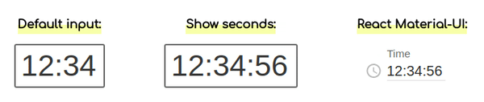

# react-simple-timefield

Simple React time input field, check out [demo](https://antonfisher.com/react-simple-timefield/).

[](https://travis-ci.org/antonfisher/react-simple-timefield)
[](https://coveralls.io/github/antonfisher/react-simple-timefield?branch=master)
[](https://www.npmjs.com/package/react-simple-timefield)
[](https://www.npmjs.com/package/react-simple-timefield)
[](https://github.com/antonfisher/react-simple-timefield/blob/master/LICENSE)

[](https://antonfisher.com/react-simple-timefield/)

## Installation
```bash
npm install --save react-simple-timefield

#for React <16 use: npm install --save react-simple-timefield@1
```

## Usage
```jsx
import TimeField from 'react-simple-timefield';
...
<TimeField
    value={time}                       // {String}   required, format '00:00' or '00:00:00'
    onChange={(event, value) => {...}} // {Function} required
    input={<MyCustomInputElement />}   // {Element}  default: <input type="text" />
    colon=":"                          // {String}   default: ":"
    showSeconds                        // {Boolean}  default: false
/>
```

## Real world example
```jsx
import TimeField from 'react-simple-timefield';

class App extends React.Component {
  constructor(...args) {
    super(...args);

    this.state = {
      time: '12:34'
    };

    this.onTimeChange = this.onTimeChange.bind(this);
  }

  onTimeChange(event, time) {
    this.setState({time});
  }

  render() {
    const {time} = this.state;

    return (
      <TimeField value={time} onChange={this.onTimeChange} />
    );
  }
}
```

## Version 2 to 3 migration

There is a breaking change in version 3.
The `onChange` callback property will be called with two arguments.

```jsx
// Before:
<TimeField onChange={(value) => console.log(value)} />

//After
<TimeField onChange={(event, value) => console.log(event, value)} />
```

## Contributing

#### Run demo:
For running demo locally, replace:
```javascript
import TimeField from '../';
// to
import TimeField from '../src';
```
in `demo/index.js` file.

```bash
# run development mode
cd demo
npm run dev
```

#### Build:
```bash
npm test
npm run format
npm run build
```

## License
MIT License. Free use and change.
